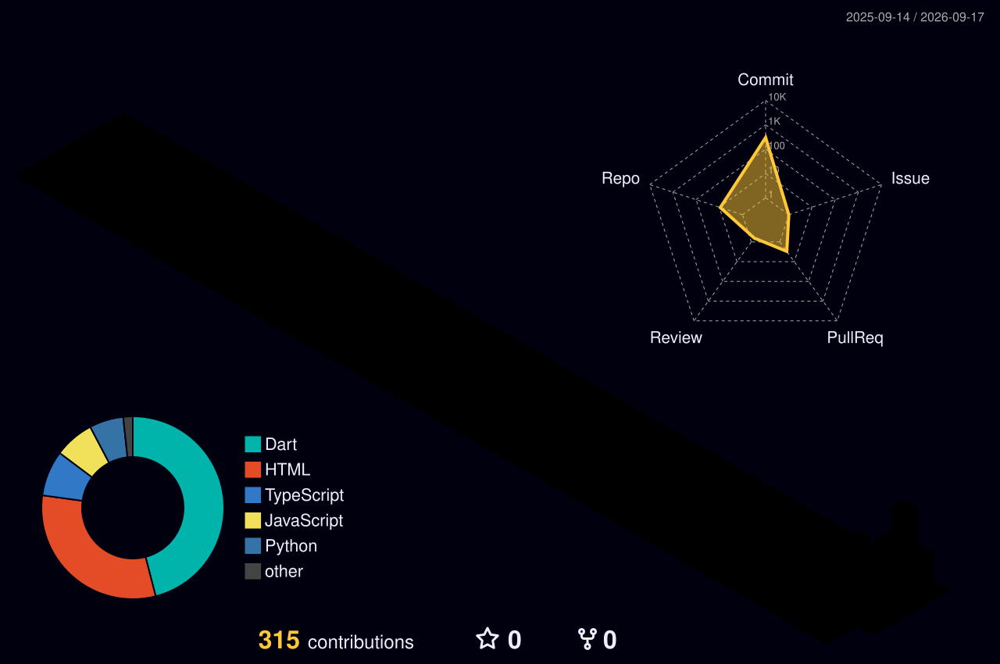

# Hi 👋, I'm Syed Nahian Siam

 

---

### 👨‍💻 About Me
- 🌐 **Portfolio & Live Works:** [knecrow.github.io/portfolio](https://knecrow.github.io/portfolio/)
- 🔭 **Currently Building:** Cross-platform mobile solutions with **Flutter & Dart** and scalable backends with **Python & Django**.
- 🤖 **Exploring:** Generative AI integrations, futuristic HUDs, and real-time audio/visual web interfaces.
- 💡 **Passion:** Crafting buttery-smooth animations, dark luxury aesthetics, and high-performance developer tools.
- 🌱 **Learning:** Advanced distributed architectures, Go, and high-concurrency systems.

---

### 🛠️ Tech Stack & Arsenal

  

---

### 🌟 Featured Repositories

| Project | Description | Stack |
| :--- | :--- | :--- |
| 🛡️ **[Aegis](https://github.com/Knecrow/Aegis)** | Next-Gen Marvel JARVIS & ULTRON holographic web interface powered by Google Gemini AI, speech synthesis, and real-time audio spectrum visualization. | `JavaScript` `Gemini AI` `Web Audio API` |
| ⚔️ **[Aumbra](https://github.com/Knecrow/Aumbra)** | Solo Leveling inspired daily quest RPG for self-improvement featuring Gemini AI quest master, SQLite, and Firebase. | `Flutter` `Dart` `Firebase` `Gemini AI` |
| 💎 **[Estash](https://github.com/Knecrow/Estash)** | Sleek, modern personal finance & budget tracker with dark luxury aesthetics, real-time analytics, and smooth micro-animations. | `Flutter` `Dart` `Hive` `Provider` |
| 📚 **[Tutracker](https://github.com/Knecrow/Tutracker)** | Premium native mobile tuition & student management app with Riverpod state management and offline-first Hive storage. | `Flutter` `Dart` `Riverpod` `Hive` |
| ⏳ **[Hourglass](https://github.com/Knecrow/Hourglass)** | Animated browser-based focus timer with physics-driven sand flow countdown for productivity sprints. | `JavaScript` `HTML5 Canvas` `CSS3` |

---

### 📊 GitHub Activity & Metrics

  
  
    
  

---

### 🧊 3D Isometric Contribution City

  <picture>
    <source media="(prefers-color-scheme: dark)" srcset="profile-3d-contrib/profile-night-rainbow.svg">
    <source media="(prefers-color-scheme: light)" srcset="profile-3d-contrib/profile-green-animate.svg">
    
  </picture>

---

  Designed & Developed by Syed Nahian Siam • Powered by Open Source

