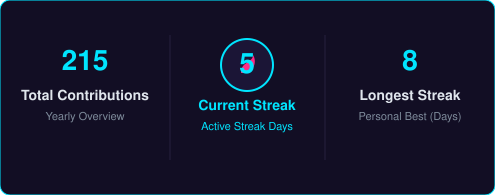

<div align="center">


# Syed Nahian Siam

<a href="https://git.io/typing-svg">
  
</a>

<br/>

[](https://knecrow.github.io/)
[](https://linkedin.com/in/syed-nahian)
[](mailto:syednahian906@gmail.com)
[](https://github.com/Knecrow)

</div>

---

### About Me

```text
╭─────────────────────────────────────────────────────────────────╮
│ USER         : Syed Nahian Siam                                 │
│ LOCATION     : Dhaka, Bangladesh                                │
│ ROLE         : CS Student & Software Developer                  │
│ FOCUS        : Flutter • Dart • Python • Web • AI               │
│ PORTFOLIO    : https://knecrow.github.io/                       │
│ STATUS       : Building projects and learning every day         │
╰─────────────────────────────────────────────────────────────────╯
```

---

### Tech Stack

<p align="center">
  <b>Languages</b><br/>
  <br/><br/>
  <b>Frameworks, Tools & Databases</b><br/>
  
</p>

---

### Featured Projects

<table>
  <tr>
    <td width="50%" valign="top">
      <h3 align="center">Project Aegis</h3>
      <p align="center">JARVIS-style voice assistant HUD powered by Google Gemini AI and Web Audio waveform analysis.</p>
      <p align="center"><code>JavaScript</code> • <code>Gemini AI</code> • <code>Web Audio</code></p>
      <p align="center">
        <a href="https://github.com/Knecrow/Aegis"><b>Code</b></a> &nbsp;|&nbsp; 
        <a href="https://knecrow.github.io/Aegis/"><b>Live Demo</b></a>
      </p>
    </td>
    <td width="50%" valign="top">
      <h3 align="center">Untold</h3>
      <p align="center">Anonymous digital corkboard web app for sharing thoughts and wins on colorful digital sticky notes.</p>
      <p align="center"><code>Next.js</code> • <code>TypeScript</code> • <code>Drizzle ORM</code> • <code>PostgreSQL</code></p>
      <p align="center">
        <a href="https://github.com/Knecrow/Untold"><b>Code</b></a>
      </p>
    </td>
  </tr>
  <tr>
    <td width="50%" valign="top">
      <h3 align="center">Estash</h3>
      <p align="center">Personal finance & daily budget tracker with spending alerts and offline-first local storage.</p>
      <p align="center"><code>Flutter</code> • <code>Dart</code> • <code>Hive DB</code> • <code>Provider</code></p>
      <p align="center">
        <a href="https://github.com/Knecrow/Estash"><b>Code</b></a> &nbsp;|&nbsp;
        <a href="https://github.com/Knecrow/Estash/releases/latest"><b>Download APK</b></a>
      </p>
    </td>
    <td width="50%" valign="top">
      <h3 align="center">Aumbra</h3>
      <p align="center">Solo Leveling inspired daily quest RPG app for habit-building and stat leveling with Gemini AI feedback.</p>
      <p align="center"><code>Flutter</code> • <code>Dart</code> • <code>Firebase</code> • <code>Gemini AI</code></p>
      <p align="center">
        <a href="https://github.com/Knecrow/Aumbra"><b>Code</b></a> &nbsp;|&nbsp;
        <a href="https://github.com/Knecrow/Aumbra/releases/latest"><b>Download APK</b></a>
      </p>
    </td>
  </tr>
</table>

---

### Activity

<div align="center">
  
  
  <br/><br/>
  
</div>

---

### 3D Contribution Graph

<div align="center">
  <picture>
    <source media="(prefers-color-scheme: dark)" srcset="profile-3d-contrib/profile-night-view.svg">
    <source media="(prefers-color-scheme: light)" srcset="profile-3d-contrib/profile-green-animate.svg">
    
  </picture>
</div>

---

<div align="center">
  <sub>Syed Nahian Siam</sub>
</div>
