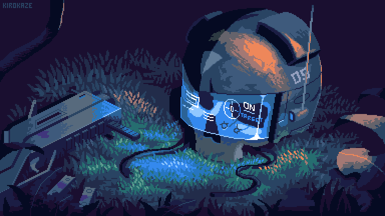
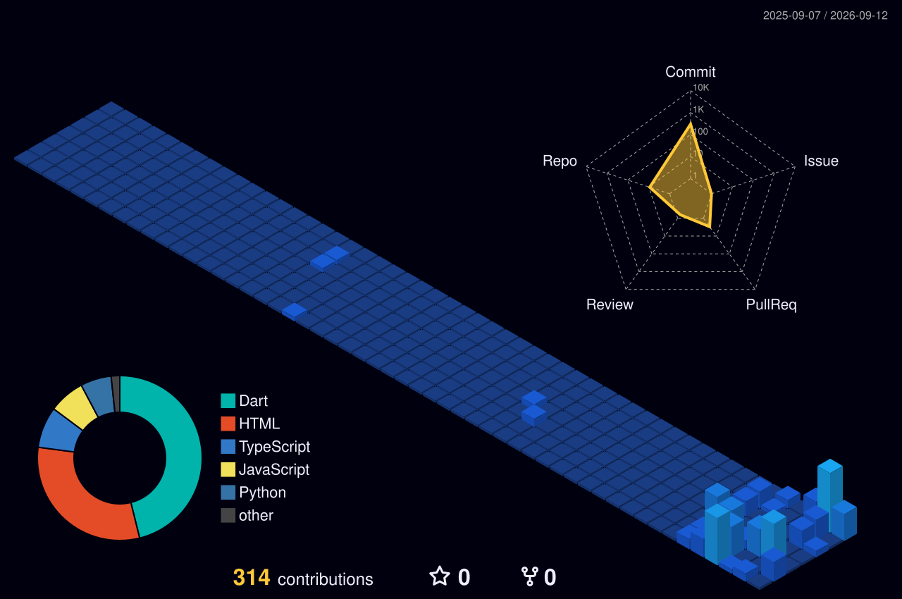

<div align="center">



# 🌃 Syed Nahian Siam

<a href="https://git.io/typing-svg">
  
</a>

<br/>

[](https://knecrow.github.io/portfolio/)
[](https://linkedin.com/in/syed-nahian)
[](mailto:syednahian906@gmail.com)
[](https://github.com/Knecrow)

</div>

---

### 👾 System Diagnostics

```text
╭─────────────────────────────────────────────────────────────────╮
│ 🌃 USER      : Syed Nahian Siam                                 │
│ 📍 BASE      : Dhaka, Bangladesh 🇧🇩                              │
│ ⚡ CLASS     : Full-Stack Developer & Vibecoder                │
│ 🔮 FOCUS     : Flutter • Dart • Python/Django • Generative AI   │
│ 🌐 PORTFOLIO : https://knecrow.github.io/portfolio/            │
│ 🌧️ STATUS    : Crafting cybernetic mobile & web systems        │
╰─────────────────────────────────────────────────────────────────╯
```

---

### 🛠️ Arsenal & Cybernetic Tools

<p align="center">
  <b>Languages & Core</b><br/>
  <br/><br/>
  <b>Frameworks, Cloud & Tooling</b><br/>
  
</p>

---

### 🚀 Featured Deployments

<table>
  <tr>
    <td width="50%" valign="top">
      <h3 align="center">🛡️ Project Aegis</h3>
      <p align="center">JARVIS & ULTRON holographic web HUD powered by Google Gemini AI and Web Audio spectrum analysis.</p>
      <p align="center"><code>JavaScript</code> • <code>Gemini AI</code> • <code>Web Audio</code></p>
      <p align="center">
        <a href="https://github.com/Knecrow/Aegis"><b>Code ➔</b></a> &nbsp;|&nbsp; 
        <a href="https://knecrow.github.io/Aegis/"><b>Live Demo ➔</b></a>
      </p>
    </td>
    <td width="50%" valign="top">
      <h3 align="center">⚔️ Aumbra</h3>
      <p align="center">Solo Leveling inspired daily quest RPG for self-improvement with Gemini AI quest master & Firebase.</p>
      <p align="center"><code>Flutter</code> • <code>Dart</code> • <code>Firebase</code> • <code>Gemini AI</code></p>
      <p align="center">
        <a href="https://github.com/Knecrow/Aumbra"><b>Code ➔</b></a>
      </p>
    </td>
  </tr>
  <tr>
    <td width="50%" valign="top">
      <h3 align="center">💎 Estash</h3>
      <p align="center">Sleek personal finance & daily budget tracker with dark luxury aesthetics and fluid micro-animations.</p>
      <p align="center"><code>Flutter</code> • <code>Dart</code> • <code>Hive DB</code> • <code>Provider</code></p>
      <p align="center">
        <a href="https://github.com/Knecrow/Estash"><b>Code ➔</b></a>
      </p>
    </td>
    <td width="50%" valign="top">
      <h3 align="center">📚 Tutracker</h3>
      <p align="center">Native tuition & student management app built with Riverpod and offline-first Hive storage.</p>
      <p align="center"><code>Flutter</code> • <code>Dart</code> • <code>Riverpod</code> • <code>Hive DB</code></p>
      <p align="center">
        <a href="https://github.com/Knecrow/Tutracker"><b>Code ➔</b></a>
      </p>
    </td>
  </tr>
</table>

---

### 📊 Activity & Telemetry

<div align="center">
  
  
  <br/><br/>
  
</div>

---

### 🧊 Cyberpunk Isometric City Grid

<div align="center">
  <picture>
    <source media="(prefers-color-scheme: dark)" srcset="profile-3d-contrib/profile-night-view.svg">
    <source media="(prefers-color-scheme: light)" srcset="profile-3d-contrib/profile-green-animate.svg">
    
  </picture>
</div>

---

<div align="center">
  <sub>⚡ Designed & Developed by Syed Nahian Siam • Built in the Cyberpunk Grid 🌧️</sub>
</div>
